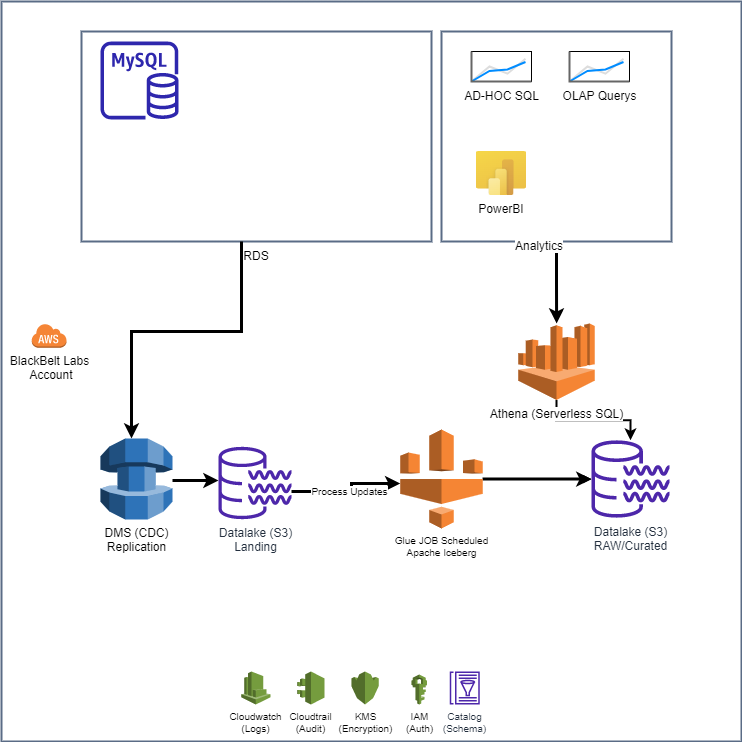

  

# Lake House Sample App
This project is intended to be a template of a AWS Lake House based on Apache Iceberg.
In a Lake House architecture, the storage layer provides durable, scalable, and cost-effective components to store and manage vast quantities of data and also allowing the data to be updated.

## Apache Iceberg
Apache Iceberg (https://iceberg.apache.org/) runs on top of Spark and have integration with AWS Glue and AWS Athena to allow:
* Schema Evolution
* Data Compaction
* Insert / Update / Delete operations
* etc

##  Architecture

### Components
##### Source Aurora MySQL DB
On this application the source of data is a SQL Database, which will be replicated into Data Lake in a Change Data Capture (CDC) ingestion.
##### AWS DMS
An AWS DMS instance and its source and target endpoints pointing to Aurora and S3 respectively is responsible to perform the data replication using an CDC Task.
##### Datalake S3 Landing layer
The first destination of data is on a S3 bucket called 'landing', in CSV format. The first column of each record have information on the operation (Insert, Update, Delete: I, U, D).
##### Datalake S3 RAW Layer
RAW Data of replicated DB on Parquet format and with Iceberg Metadata
##### AWS Glue Job
A Glue Job with Apache Iceberg connector and Job Bookmark will run on each update on Landing and will execute the operation on RAW Layer
##### AWS Athena
AWS Athena has native integration with Apache Iceberg tables, allowing SQL queries to be executed on demand

